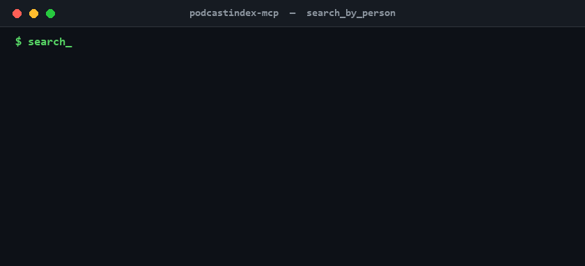

<div align="center">

# Podcast Index MCP Server

Connect Claude to the Podcast Index API. Search podcasts, track appearances, monitor trends.

[](https://github.com/conorbronsdon/podcastindex-mcp/stargazers)
[](LICENSE)
[](https://www.npmjs.com/package/podcastindex-mcp)
[](https://chainofthought.show)
[](https://x.com/ConorBronsdon)

</div>

---



The results shown in the demo above are sample data, not real Podcast Index responses.

<a href="https://glama.ai/mcp/servers/conorbronsdon/podcastindex-mcp">
  
</a>

## About

Built and maintained by [Conor Bronsdon](https://github.com/conorbronsdon) for the [Chain of Thought](https://chainofthought.show) podcast production workflow, where it surfaces guest appearances and checks feed health during research. Conor hosts Chain of Thought, a show about AI infrastructure and how practitioners actually build with it. More tools for creators live in [ai-tools-for-creators](https://github.com/conorbronsdon/ai-tools-for-creators). Find Conor on X at [@ConorBronsdon](https://x.com/ConorBronsdon).

**Sibling MCP servers:**
- [Transistor-MCP](https://github.com/conorbronsdon/Transistor-MCP): manage podcast episodes, analytics, and transcripts on Transistor.fm
- [substack-mcp](https://github.com/conorbronsdon/substack-mcp): read posts and manage Substack drafts

## Prerequisites

- Node.js 18+
- Free Podcast Index API credentials -- get them at [api.podcastindex.org](https://api.podcastindex.org/)

## Installation

```bash
git clone https://github.com/conorbronsdon/podcastindex-mcp.git
cd podcastindex-mcp
npm install
npm run build
```

## Configuration

### Claude Desktop

Add to your Claude Desktop config (`claude_desktop_config.json`):

```json
{
  "mcpServers": {
    "podcastindex": {
      "command": "node",
      "args": ["/path/to/podcastindex-mcp/build/index.js"],
      "env": {
        "PODCASTINDEX_API_KEY": "your-api-key",
        "PODCASTINDEX_API_SECRET": "your-api-secret"
      }
    }
  }
}
```

### Claude Code

Add to your project's `.mcp.json`:

```json
{
  "mcpServers": {
    "podcastindex": {
      "command": "node",
      "args": ["/path/to/podcastindex-mcp/build/index.js"],
      "env": {
        "PODCASTINDEX_API_KEY": "your-api-key",
        "PODCASTINDEX_API_SECRET": "your-api-secret"
      }
    }
  }
}
```

## Tools

This server is entirely read-only: every tool declares the MCP [tool annotation](https://modelcontextprotocol.io/docs/concepts/tools#tool-annotations) `readOnlyHint: true`, so clients know no call mutates anything and can skip write-consent prompts.

| Tool | Description |
|------|-------------|
| `search_by_person` | Search for episodes where a person appeared as host or guest. Returns matches across all indexed podcasts. |
| `search_by_term` | Full-text search across all podcasts by topic, show name, or keyword. |
| `search_by_title` | Search for podcasts by title. |
| `podcast_by_feed_url` | Look up a podcast by RSS feed URL. Returns feed ID, iTunes ID, categories, last update, and feed health. |
| `podcast_by_feed_id` | Look up a podcast by its Podcast Index feed ID. Returns full metadata. |
| `podcast_by_itunes_id` | Look up a podcast by its Apple Podcasts (iTunes) ID. |
| `podcast_by_guid` | Look up a podcast by its `podcast:guid` tag value. |
| `trending_podcasts` | Get currently trending podcasts, with optional language and category filters. |
| `episodes_by_feed_id` | Get episodes for a specific podcast by feed ID. |
| `episode_by_id` | Look up a single episode by its Podcast Index episode ID. |
| `episodes_live` | Get episodes that are currently live (actively streaming). |
| `recent_episodes` | Get the most recently published episodes across the entire index. |
| `recent_feeds` | Get the most recently updated podcast feeds across the index. |
| `recent_new_feeds` | Get podcast feeds newly added to the index. |
| `value_by_feed_id` | Get value4value (lightning payment) info for a podcast by feed ID. |
| `value_by_feed_url` | Get value4value (lightning payment) info for a podcast by feed URL. |
| `categories_list` | Get the full list of Podcast Index categories and their IDs. |
| `stats_current` | Get current aggregate statistics for the Podcast Index. |

### Typed errors

API failures are mapped to a typed error hierarchy (`PodcastIndexError` base, with `AuthenticationError`, `RateLimitError`, `ValidationError`, `NotFoundError`, and `ServerError` subclasses keyed off HTTP status) in `src/errors.ts`. Every tool call still returns the same `isError: true` response shape on failure — the typed hierarchy just makes the message specific to what went wrong (bad credentials vs. rate limiting vs. a malformed request, etc.) instead of a single generic "API error" string.

## Example Prompts

Once configured, you can ask Claude things like:

- "Search Podcast Index for all episodes featuring Satya Nadella as a guest"
- "What are the trending technology podcasts right now?"
- "Look up the feed health for https://feeds.transistor.fm/chain-of-thought and list the last 5 episodes"

## Development

Build the project:

```bash
npm run build
```

Watch for changes during development:

```bash
npm run watch
```

### Adding a new tool

1. Add the API method to `src/api-client.ts`
2. Add type guard and argument types to `src/types.ts`
3. Add the tool definition and handler to `src/tool-handlers.ts`
4. Rebuild with `npm run build`

## Contributing

Issues and pull requests are welcome. If there is a Podcast Index endpoint you want exposed as a tool, open an issue describing the use case, or follow the steps above and open a PR. Bug reports should include the tool name and the arguments you passed.

## Acknowledgments

This server exists because of the free, open [Podcast Index](https://podcastindex.org/) API and its [documentation](https://podcastindex-org.github.io/docs-api/) — all tools here are thin wrappers over that API.

The expanded endpoint coverage and typed-error design in this release were inspired by Craig Lawton's [podcastindex-mcp-server](https://github.com/cclawton/podcastindex-mcp-server), an earlier MCP server for the same API. No code from that project was used here; this server's implementation, tool schemas, and error-handling code were written independently against the official API docs.

---

## Disclaimer

*All views, opinions, and statements expressed on this account are solely my own and are made in my personal capacity. They do not reflect, and should not be construed as reflecting, the views, positions, or policies of Modular. This account is not affiliated with, authorized by, or endorsed by Modular in any way.*

## License

MIT
